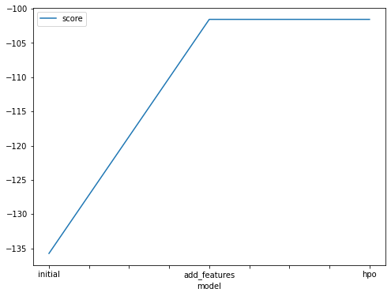
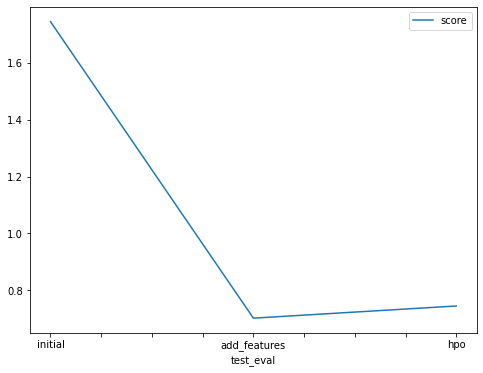

# Report: Predict Bike Sharing Demand with AutoGluon Solution
#### NAME HERE

## Initial Training
### What did you realize when you tried to submit your predictions? What changes were needed to the output of the predictor to submit your results?
I needed to set everything to be > 0 so that kaggle would accept my submission

### What was the top ranked model that performed?
Initial      - NeuralNetFastAI_BAG_L1
New_Features - KNeighborsUnif_BAG_L1
Hpo          - KNeighborsUnif_BAG_L1

## Exploratory data analysis and feature creation
### What did the exploratory analysis find and how did you add additional features?
Most of the columns are normally distributed, some are a little skewed. 

The distribution of the datetime column didn't give alot of good information so we added additional features by separating the column into new `day` and `hour` columns

### How much better did your model preform after adding additional features and why do you think that is?
A lot better like 1.2 increase of the score.
Because day and hour gave much more information rather than the datetime.

## Hyper parameter tuning
### How much better did your model preform after trying different hyper parameters?
Not that much it was almost the same performance.

### If you were given more time with this dataset, where do you think you would spend more time?
Hyperparameter tuning but for the WeightedEnsemble_L3, and maybe adding more features and fix the skewed data.

### Create a table with the models you ran, the hyperparameters modified, and the kaggle score.
|model       |num_bag_folds|num_stack_levels|num_bag_sets|score  |
|------------|-------------|----------------|------------|-------|
|initial     |0            |0               |0           |1.74396|
|add_features|0            |0               |0           |0.70253|
|hpo         |5            |2               |10          |0.74530|

### Create a line plot showing the top model score for the three (or more) training runs during the project.

### Create a line plot showing the top kaggle score for the three (or more) prediction submissions during the project.

## Summary
In Summary the added features gave the better performance so to Improve the solution we could spend much more time on the best performing model and truing to tune it to gain even better results.
 